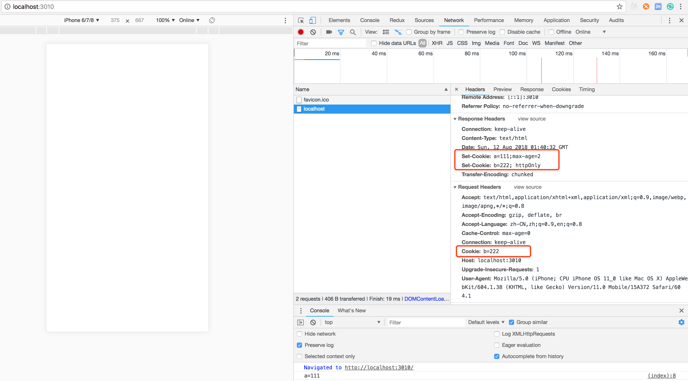

# Cookie 和 Session

## Cooike

通过 Set-Cookie 设置，下次请求会自动带上，键值对形式可以设置多个

### Cookie 属性

* max-age 或 expires 设置过期时间
* Secure 只在 https 发送
* httpOnly 无法通过 document.cookie 访问

### Cooike 示例

**cookie.html**

控制台打印输出 cookie 信息

```html
<html>
    <head>
        <meta charset="utf-8" />
        <title>Cookie</title>
    </head>
    <body>
        <script>
            console.log(document.cookie);    
        </script>
    </body>
</html>
```

**cookie.js**

设置两个 cookie，a=111 设置过期时间 2 秒钟，b=222 设置 httpOnly

```js
const http = require('http');
const fs = require('fs');
const port = 3010;

http.createServer((request, response) => {
    console.log('request url: ', request.url);

    if (request.url === '/') {
        const html = fs.readFileSync('./cookie.html', 'utf-8');
    
        response.writeHead(200, {
            'Content-Type': 'text/html',
            'Set-Cookie': ['a=111;max-age=2', 'b=222; httpOnly'],
        });

        response.end(html);
    }

}).listen(port);

console.log('server listening on port ', port);
```

**返回结果**

可以看到当 b=222 设置了 httpOnly 之后，js 就无法读取到该 cookie 值，示例中只输出了 a=111



### cookie 的 domain 设置

如果想要在一个域名的二级域名中共享同一个 cookie 需要做 domain 设置

以下例子中，假设 test.com 是一级域名，设置一些 cookie 信息，同时设置 domain，使得二级域名可以共享，在之后的二级域名例如 a.test.com, b.test.com 访问中都可以访问到同一个 cookie 信息。

```js
const http = require('http');
const fs = require('fs');
const port = 3010;

http.createServer((request, response) => {
    console.log('request url: ', request.url);

    if (request.url === '/') {
        const html = fs.readFileSync('./cookie.html', 'utf-8');
    
        if (request.headers.host === 'test.com') {
            response.writeHead(200, {
                'Content-Type': 'text/html',
                'Set-Cookie': ['a=111;max-age=2', 'b=222; httpOnly; domain=test.com'],
            });
        }

        response.end(html);
    }

}).listen(port);

console.log('server listening on port ', port);
```

## Session

```
//todo
```