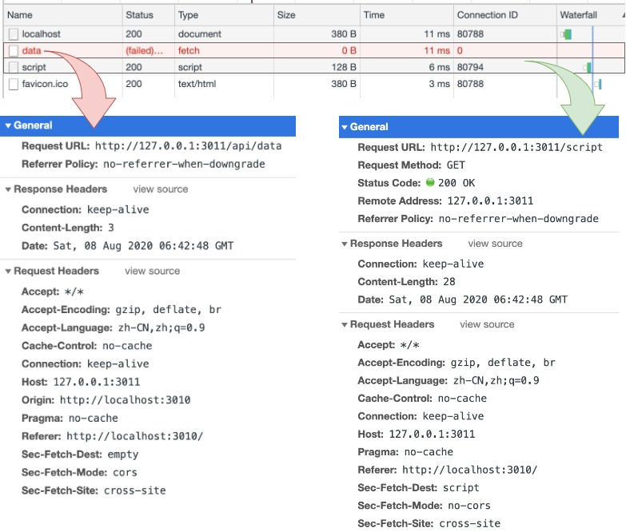
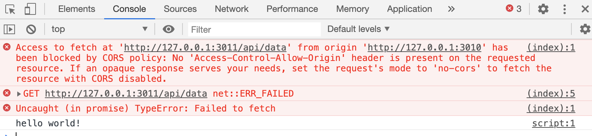
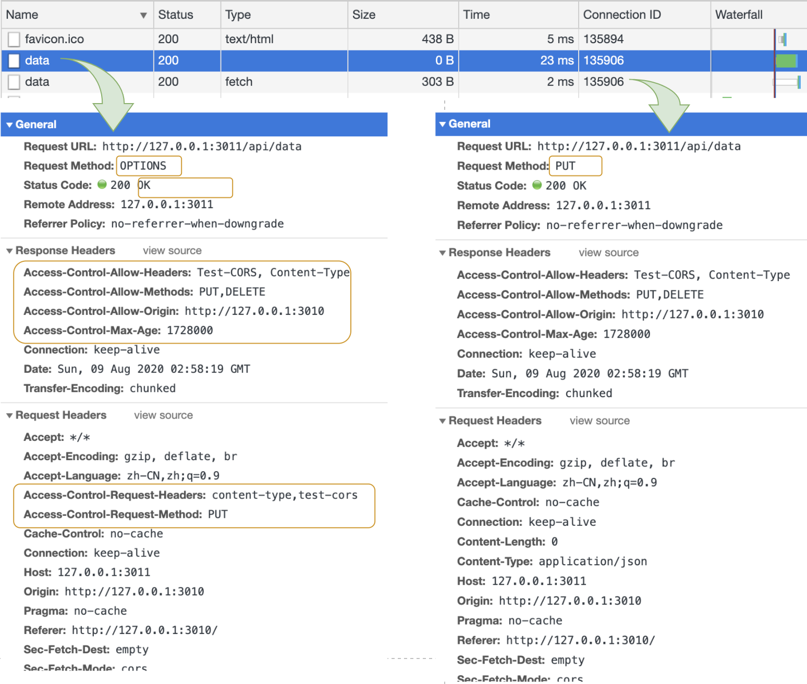

# 跨域（CORS）产生原因分析与解决方案，这一次彻底搞懂它

Cross-origin Resource Sharing 中文名称 “**跨域资源共享**” 简称 “**CORS**”，它突破了一个请求在浏览器发出只能在同源的情况下向服务器获取数据的限制。

本文会先从一个示例开始，分析是浏览器还是服务器的限制，之后讲解什么时候会产生预检请求，在整个过程中，也会讲解一下解决该问题的实现方法，文末会再总结如何使用 Node.js 中的 cors 模块和 Nginx 反向代理来解决跨域问题。

文中使用 Node.js 做一些 Demo 的演示，每一小节之后也会给予代码的 Demo 地址。

## 浏览器还是服务器的限制

先思考下，CORS 是浏览器端还是服务器端的限制？为了更好的说明这个问题，从一段示例开始。

### 从一段示例开始

**index.html**

创建 index.html 使用 fetch 调用 http://127.0.0.1:3011/api/data

```html
<body>
  <!-- <script src="https://cdn.bootcdn.net/ajax/libs/fetch/3.0.0/fetch.min.js"></script> -->
  <script>
    fetch('http://127.0.0.1:3011/api/data');
  </script>
</body>
```

**client.js**

创建 client.js 用来加载上面 index.html。设置端口为 3010。

```js
const http = require('http');
const fs = require('fs');
const PORT = 3010;
http.createServer((req, res) => {
  fs.createReadStream('index.html').pipe(res);
}).listen(PORT);
```

**server.js**

创建 server.js 开启一个服务，根据不同的请求返回不同的响应。设置端口为 3011。

```js
const http = require('http');
const PORT = 3011;

http.createServer((req, res) => {
  const url = req.url;
  console.log('request url: ', url);
  if (url === '/api/data') {
    return res.end('ok!');
  }
  if (url === '/script') {
    return res.end('console.log("hello world!");');
  }
}).listen(PORT);

console.log('Server listening on port ', PORT);
```

### 测试分析原因

运行上面的 client.js、server.js 浏览器输入 http://127.0.0.1:3010 在 Chrome 浏览器中打开 Network 项查看请求信息，如下所示：



左侧是使用 fetch 请求的 127.0.0.1:3011/api/data 接口，在请求头里可以看到有 Origin 字段，显示了我们当前的请求信息。另外还有三个 Sec-Fetch-* 开头的字段，这是一个新的草案 **[Fetch Metadata Request Headers](https://w3c.github.io/webappsec-fetch-metadata/)**。

其中 Sec-Fetch-Mode 表示请求的模式，通过左右两侧结果对比也可以看出左侧是跨域的。Sec-Fetch-Site 表示的是这个请求是同源还是跨域，由于我们这两个请求都是由 3010 端口发出去请求 3011 端口，是不符合同源策略的。

看下浏览器 Console 下的日志信息，根据提示得知原因是从 “http://127.0.0.1:3010” 访问 “http://127.0.0.1:3011/api/data” 被 CORS 策略阻止了，没有 “Access-Control-Allow-Origin” 标头。



在看下服务端的日志，因为请求 3011 服务，所以就看下 3011 服务的日志信息：

```
Server listening on port  3011
request url:  /script
request url:  /api/data
```

在服务端是有收到请求信息的，说明服务端是正常工作的。

我们也可以在终端通过 curl 命令测试下，在终端脱离浏览器环境也是可以正常请求的。

```
$ curl http://127.0.0.1:3011/api/data
ok!
```

本节代码示例：

```
github.com/qufei1993/http-protocol/tree/master/example/cors/01
```

### 总结回答最开始提出的问题

**浏览器限制了从脚本内发起的跨源 HTTP 请求**，例如 **XMLHttpRequest** 和我们本示例中使用的 **Fetch API 都是遵循的同源策略**。

当一个请求在浏览器端发送出去后，服务端是会收到的并且也会处理和响应，只不过浏览器在解析这个请求的响应之后，发现不属于浏览器的**同源策略**（地址里面的协议、域名和端口号均相同）也没有包含正确的 CORS 响应头，返回结果被浏览器给拦截了。

## 预检请求

预检请求是在发送实际的请求之前，客户端会先发送一个 OPTIONS 方法的请求向服务器确认，如果通过之后，浏览器才会发起真正的请求，这样可以避免跨域请求对服务器的用户数据造成影响。

看到这里你可能有疑问为什么上面的示例没有预检请求？因为 **CORS 将请求分为了两类：简单请求和非简单请求**。我们上面的情况属于简单请求，所以也就没有了预检请求。

让我们继续在看下简单请求和非简单请求是如何定义的。

### 预检请求定义

根据 MDN 的文档定义，请求方法为：GET、POST、HEAD，请求头 Content-Type 为：text/plain、multipart/form-data、application/x-www-form-urlencoded 的就属于 “简单请求” 不会触发 CORS 预检请求。

例如，如果请求头的 Content-Type 为 application/json 就会触发 CORS 预检请求，这里也会称为 “非简单请求”。

[“MDN 文档 developer.mozilla.org/en-US/docs/Web/HTTP/CORS 简单请求”](https://developer.mozilla.org/en-US/docs/Web/HTTP/CORS) 有更多关于简单请求的字段定义。

### 预检请求示例

通过一个示例学习下预检请求。

#### 设置客户端

为 index.html 里的 fetch 方法增加一些设置，设置请求的方法为 PUT，请求头增加一个自定义字段 Test-Cors。

```html
<script>
  fetch('http://127.0.0.1:3011/api/data', {
    method: 'PUT',
    headers: {
      'Content-Type': 'text/plain',
      'Test-Cors': 'abc'
    }
  });
</script>
```

上述代码在浏览器执行时会发现是一个非简单请求，就会先执行一个预检请求，Request Headers 会有如下信息：

```
OPTIONS /api/data HTTP/1.1
Host: 127.0.0.1:3011
Access-Control-Request-Method: PUT
Access-Control-Request-Headers: content-type,test-cors
Origin: http://127.0.0.1:3010
Sec-Fetch-Mode: cors
```

可以看到有一个 OPTIONS 是预检请求使用的方法，该方法是在 HTTP/1.1 协议中所定义的，还有一个重要的字段 **Origin 表示请求来自哪个源**，服务端则可以根据这个字段判断是否是合法的请求源，例如 Websocket 中因为没有了同源策略限制，服务端可以根据这个字段来判断。

**Access-Control-Request-Method** 告诉服务器，实际请求将使用 PUT 方法。

**Access-Control-Request-Headers** 告诉服务器，实际请求将使用两个头部字段 content-type,test-cors。这里如果 content-type 指定的为简单请求中的几个值，Access-Control-Request-Headers 在告诉服务器时，实际请求将只有 test-cors 这一个头部字段。

#### 设置服务端

上面讲解了客户端的设置，同样的要使请求能够正常响应，还需服务端的支持。

修改我们的 server.js 重点是设置 Response Headers 代码如下所示：

```js
res.writeHead(200, {
  'Access-Control-Allow-Origin': 'http://127.0.0.1:3010',
  'Access-Control-Allow-Headers': 'Test-CORS, Content-Type',
  'Access-Control-Allow-Methods': 'PUT,DELETE',
  'Access-Control-Max-Age': 86400
});
```

为什么是以上配置？首先预检请求时，浏览器给了服务器几个重要的信息 Origin、Method 为 PUT、Headers 为 content-type,test-cors 服务端在收到之后，也要做些设置，给予回应。

Access-Control-Allow-Origin 表示 “http://127.0.0.1:3010” 这个请求源是可以访问的，该字段也可以设置为 “*” 表示允许任意跨源请求。

Access-Control-Allow-Methods 表示服务器允许客户端使用 PUT、DELETE 方法发起请求，可以一次设置多个，表示服务器所支持的所有跨域方法，而不单是当前请求那个方法，这样好处是为了避免多次预检请求。

Access-Control-Allow-Headers 表示服务器允许请求中携带 Test-CORS、Content-Type 字段，也可以设置多个。

Access-Control-Max-Age 表示该响应的有效期，单位为秒。在有效时间内，浏览器无须为同一请求再次发起预检请求。还有一点需要注意，该值要小于浏览器自身维护的最大有效时间，否则是无效的。

看下增加了预检请求的效果，第一次先发出了 OPTIONS 请求，并且在请求头设置了本次请求的方法和 Headers 信息，服务端在 Response 也做了回应，在 OPTIONS 成功之后，浏览器紧跟着才发起了我们本次需要的真实请求，如图右侧所示 Resquest Method 为 PUT。



本节代码示例：
```
github.com/qufei1993/http-protocol/tree/master/example/cors/02
```

## CORS 与认证

对于跨域的 XMLHttpRequest 或 Fetch 请求，浏览器是不会发送身份凭证信息的。例如我们要在跨域请求中发送 Cookie 信息，就要做些设置：

为了能看到效果，我先自定义了一个 cookie 信息 id=NodejsRoadmap。

重点是设置认证字段，本文中 fetch 示例设置 **credentials: "include"** 如果是 XMLHttpRequest 则设置 **withCredentials:"include"**

```html
<body>
  <script>
    document.cookie = `id=NodejsRoadmap`;
    fetch('http://127.0.0.1:3011/api/data', {
      method: 'PUT',
      headers: {
        'Content-Type': 'application/json',
        'Test-Cors': 'abc',
      },
      credentials: "include"
    });
  </script>
</body>
```

经过以上设置，浏览器发送实际请求时会向服务器发送 Cookies，同时服务器也需要在响应中设置 Access-Control-Allow-Credentials 响应头

```js
res.writeHead(200, {
  'Access-Control-Allow-Origin': 'http://127.0.0.1:3010',
  'Access-Control-Allow-Credentials': true
});
```

如果服务端不设置浏览器就不会正常响应，会报一个跨域错误，如下所示：

```
Access to fetch at 'http://127.0.0.1:3011/api/data' from origin 'http://127.0.0.1:3010' has been blocked by CORS policy: Response to preflight request doesn't pass access control check: The value of the 'Access-Control-Allow-Credentials' header in the response is '' which must be 'true' when the request's credentials mode is 'include'.
```

还有一点需要注意，如果我们在请求中设置了 **credentials: "include"** 服务端就不能设置 **Access-Control-Allow-Origin: "*"** 只能设置为一个明确的地址。

本节代码示例：

```
github.com/qufei1993/http-protocol/tree/master/example/cors/03
```

## 解决跨域问题的几种方法

通过上面的分析了解跨域产生的原因之后，解决其实并不难，上面的讲解中其实也提供了解决方案，例如在 Node.js 中我们可以设置响应头部字段 Access-Control-Allow-Origin、Access-Control-Expose-Headers、Access-Control-Allow-Methods 等，但是在实际开发中这样设置难免繁琐，下面介绍几种常用的解决方法。

### 使用 CORS 模块

在 Node.js 中推荐你使用 cors 模块 [github.com/expressjs/cors](https://github.com/expressjs/cors)。 

在我们本节的示例中，一直使用的 Node.js 原生模块来编写我们的示例，在引入 cors 模块后，可以按照如下方式改写：

```js
const http = require('http');
const PORT = 3011;
const corsMiddleware = require('cors')({
  origin: 'http://127.0.0.1:3010',
  methods: 'PUT,DELETE',
  allowedHeaders: 'Test-CORS, Content-Type',
  maxAge: 1728000,
  credentials: true,
});

http.createServer((req, res) => {
  const { url, method } = req;
  console.log('request url:', url, ', request method:', method);
  const nextFn = () => {
    if (method === 'PUT' && url === '/api/data') {
      return res.end('ok!');
    }
    return res.end();
  }
  corsMiddleware(req, res, nextFn);
}).listen(PORT);
```

cors 在预检请求之后或在预检请求里并选项中设置了 preflightContinue 属性之后才会执行 nextFn 这个函数，如果预检失败就不会执行 nextFn 函数。

如果你用的 Express.js 框架，使用起来也很简单，如下所示：

```js
const express = require('express')
const cors = require('cors')
const app = express()

app.use(cors());
```

### JSONP

浏览器是允许像 link、img、script 标签在路径上加载一些内容进行请求，是允许跨域的，那么 jsonp 的实现原理就是在 script 标签里面加载了一个链接，去访问服务器的某个请求，返回内容。

```html
<body>
  <script>
    // fetch('http://127.0.0.1:3011/api/data', {
    //   method: 'PUT',
    //   headers: {
    //     'Content-Type': 'application/json',
    //     'Test-Cors': 'abc',
    //   },
    //   credentials: "include"
    // });
    <srcipt src="http://127.0.0.1:3011/api/data"></srcipt>
  </script>
</body>
```

相比上面 CORS 模块，JSONP 只支持 GET 请求，显然是没有 CORS 模块强大的。

### Nginx 代理服务器配置跨域

使用 Nginx 代理服务器之后，请求不会直接到达我们的 Node.js 服务器端，请求会先经过 Nginx 在设置一些跨域等信息之后再由 Nginx 转发到我们的 Node.js 服务端，所以这个时候我们的 Nginx 服务器去监听的 3011 端口，我们把 Node.js 服务的端口修改为 30011，简单配置如下所示：

```conf
server {
  listen          3011;
  server_name     localhost;

  location / {
    if ($request_method = 'OPTIONS') {
      add_header 'Access-Control-Allow-Origin' 'http://127.0.0.1:3010';
      add_header 'Access-Control-Allow-Methods' 'PUT,DELETE';
      add_header 'Access-Control-Allow-Headers' 'Test-CORS, Content-Type';
      add_header 'Access-Control-Max-Age' 1728000;
      add_header 'Access-Control-Allow-Credentials' 'true';
      add_header 'Content-Length' 0;
      return 204;
    }

    add_header 'Access-Control-Allow-Origin' 'http://127.0.0.1:3010';
    add_header 'Access-Control-Allow-Credentials' 'true';

    proxy_pass http://127.0.0.1:30011;
    proxy_set_header Host $host;
  }
}
```

本节代码示例：

```
github.com/qufei1993/http-protocol/tree/master/example/cors/04
```

## 总结

如果你是一个前端开发者，在工作难免会遇到跨域问题，虽然它属于浏览器的同源策略限制，但是要想解决这问题还需浏览器端与服务端的共同支持，希望读到这篇文章的读者能够理解跨域产生的原因，最后给予的几个解决方案，也希望能解决你对于跨域这个问题的困惑。

**作者简介**：五月君，软件设计师，公众号「Nodejs技术栈」作者。

## Reference

* Fetch Metadata Request Headers: https://w3c.github.io/webappsec-fetch-metadata/
* [2] “MDN 文档 developer.mozilla.org/en-US/docs/Web/HTTP/CORS 简单请求”: https://developer.mozilla.org/en-US/docs/Web/HTTP/CORS
* github.com/expressjs/cors: https://github.com/expressjs/cors