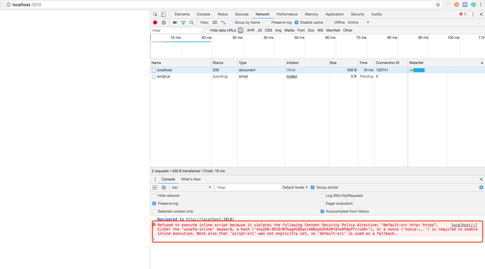

# 内容安全策略（CSP） 

Content-Security-Policy 简称 CSP 内容安全策略，限制资源获取。

## 限制方式

* default-src 限制全局
* 制定资源类型

```
connect-src manifest-src img-src style-src script-src frame-src font-src media-src ...
```

## 参考示例

Web 领域非常著名的一个攻击方式 xss，是通过某些方法在网站里面注入一些别人写好的脚本，窃取一些用户的信息，处于安全考虑不希望执行写在页面里面的一些脚本，可以在返回的 headers 里面设置 Content-Security-Policy。

**csp.html**

```html
<html>
    <head>
        <meta charset="utf-8" />
        <title>cache-control</title>
    </head>
    <body>
        <script>
            console.log('hello world!!!');    
        </script>
        <script src="/script.js"></script>
    </body>
</html>
```

**csp.js**

在 head 里设置 Content-Security-Policy 只能加载 http https

```js
const http = require('http');
const fs = require('fs');
const port = 3010;

http.createServer((request, response) => {
    console.log('request url: ', request.url);

    if (request.url === '/') {
        const html = fs.readFileSync('csp.html', 'utf-8');
    
        response.writeHead(200, {
            'Content-Type': 'text/html',
            'Content-Security-Policy': 'default-src http: https',
        });

        response.end(html);
    }
}).listen(port);
```
**运行结果**



## 更多的设置方式

**1. 限制外链加载的 javascrip 文件只能通过哪些域名加载**

只能根据本域名下的js内容进行加载

```js
response.writeHead(200, {
    'Content-Security-Policy': 'default-src \'self\'',
});
```

**2. 限制指定某个网站**

```js
response.writeHead(200, {
    'Content-Security-Policy': 'default-src \'self\' https://www.baidu.com/',
});
```

**3. 限制 form 表单的提交**

```js
response.writeHead(200, {
    'Content-Security-Policy': 'default-src \'self\'; form-action \'self\'',
});
```

**4. 内容安全策略如果出现我们不希望的情况，可以让它主动申请向我们服务器发送一个请求进行汇报**

```js
// report-uri 跟上服务器的url地址
response.writeHead(200, {
    'Content-Security-Policy': 'default-src \'self\'; report-uri /report',
});
```

**5. 除了在服务端通过 headers 指定还可以在 html 里面通过 meta 标签写**

注意：在 html 标签里通过 meta 写 report-uri 是不支持的，建议还用通过 headers 设置

```html
<meta http-equiv="Content-Security-Policy" content="default-src http: https">
```

更多内容可参考 CSP 的 CDN [参考文档 内容安全策略 (CSP) - Web 安全 | MDN](https://developer.mozilla.org/zh-CN/docs/Web/Security/CSP)