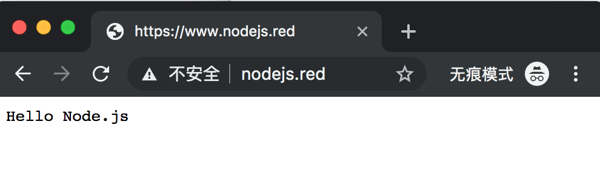

# 域名解析（DNS）过程

> 社会犹如一条船，每个人都要有掌舵的准备。——易卜生

为了方便记忆，我们通常会通过域名的方式访问网站，例如直接在浏览器地址栏输入 [www.nodejs.red](www.nodejs.red) 就可得到一个请求响应，但是在计算机网络通信时是只能识别 IP（127.0.0.1） 地址的，为什么我直接输入一串字母就可以访问呢？这背后的功劳就要归功于我们的 “翻译官” DNS 也就是域名系统，它会将我们的域名转换为 IP 地址进行工作。

**作者简介**：五月君，Nodejs Developer，慕课网认证作者，热爱技术、喜欢分享的 90 后青年，欢迎关注 [Nodejs技术栈](https://nodejsred.oss-cn-shanghai.aliyuncs.com/node_roadmap_wx.jpg?x-oss-process=style/may) 和 Github 开源项目 [https://www.nodejs.red](https://www.nodejs.red)

做为面试来讲，通常也是一个经常被拷问的面试点，不论你是做前端、后端或者运维都建议去学习下，以下会列出 DNS 解析的步骤：

## 1. 浏览器 DNS 缓存

当我们访问一个 URL，例如 [www.nodejs.red](www.nodejs.red) 会优先查找浏览器的 DNS 缓存，如果命中就会返回，未命中就会继续下一步，查找操作系统的缓存。

当你修改了本地 hosts 域名的指向也就是下面即将要讲的，会发现浏览器刷新之后并没有生效，例如 Chrome 浏览器，网上有很多答案告诉你打开 [chrome://net-internals/#dns](chrome://net-internals/#dns) 工具，通过 Clear Host Cache 来清除，然而浏览器缓存并没有发生变化，以下有一个视频演示可参考

<video src="https://static.runoob.com/video/QQ20180224-104756-HD.mp4" width="100%" height="100%"
controls="controls"></video>

因为每个浏览器都有一个固定值，这里有一个测试可参考 [https://dyn.com/blog/web-browser-dns-caching-bad-thing/](https://dyn.com/blog/web-browser-dns-caching-bad-thing/)

## 2. 系统（OS）缓存

如果浏览器的 DNS 缓存没有命中，则查看操作系统中是否有域名对应的 IP，位于操作系统的 hosts 文件，hosts 文件位置如下所示：

* Windows C:\windows\system32\drivers\etc\hosts
* Mac /private/etc/hosts
* Ubuntu /etc/hosts

做一个测试，通过修改本地 hosts 文件，我将 wwww.nodejs.red 这个域名映射为自己写的一个程序

**一个 Node.js 应用**

```js
// app.js
const http = require('http');

http.createServer((req, res) => {
    console.log('request url: ', req.url);

    res.end('Hello Node.js');
}).listen(3000)

// node app.js 开启服务
```

**修改本地 hosts**

本地 hosts 文件增加以下代码，将 www.nodejs.red 这个域名映射为 127.0.0.1 这个域名

```
127.0.0.1       www.nodejs.red
```

**Nginx 服务配置**

将域名 www.nodejs.red 转发到 http://127.0.0.1:3000 端口上，使用 https 的方式访问，以下这块属于 Nginx 方面的知识，不懂的可以去网上查看。

```conf
server {
    listen          443 ssl;
    server_name     www.nodejs.red;

    ssl_certificate_key /usr/local/etc/nginx/certs/localhost-privkey.pem;
    ssl_certificate /usr/local/etc/nginx/certs/localhost-cert.pem;

    location / {
        proxy_pass http://127.0.0.1:3000;
        proxy_set_header Host $host;
    }
}
```

浏览器地址栏输入 www.nodejs.red 之后如下所示，已被解析到我上面写的 Node.js 应用程序



**修改 hosts 文件实现域名映射，这个通常在本地做开发时候可能会用到**

## 3. 路由器缓存

当 **浏览器 DNS 缓存** 与 **系统（OS）缓存** 均无映射，则请求会发送到路由器缓存中检查

## 4. ISP DNS 缓存

ISP 为互联网服务提供商，目前我国有三大基础运营商：中国电信、中国移动和中国联通，在以上的三种情况下均找不到域名对应 IP 地址，就会进行到这一步 IPS 的 DNS 缓存查找。

举个例子，假设你用的中国联通服务提供商，则会进入联通的 DNS 缓存服务器中查找。

## Reference

* [http://igoro.com/archive/what-really-happens-when-you-navigate-to-a-url](http://igoro.com/archive/what-really-happens-when-you-navigate-to-a-url)
* [https://www.runoob.com/w3cnote/chrome-clear-dns-cache.html](https://www.runoob.com/w3cnote/chrome-clear-dns-cache.html)