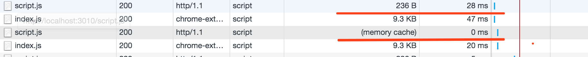
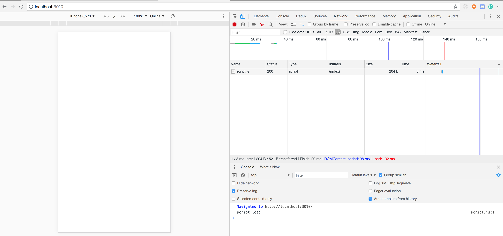
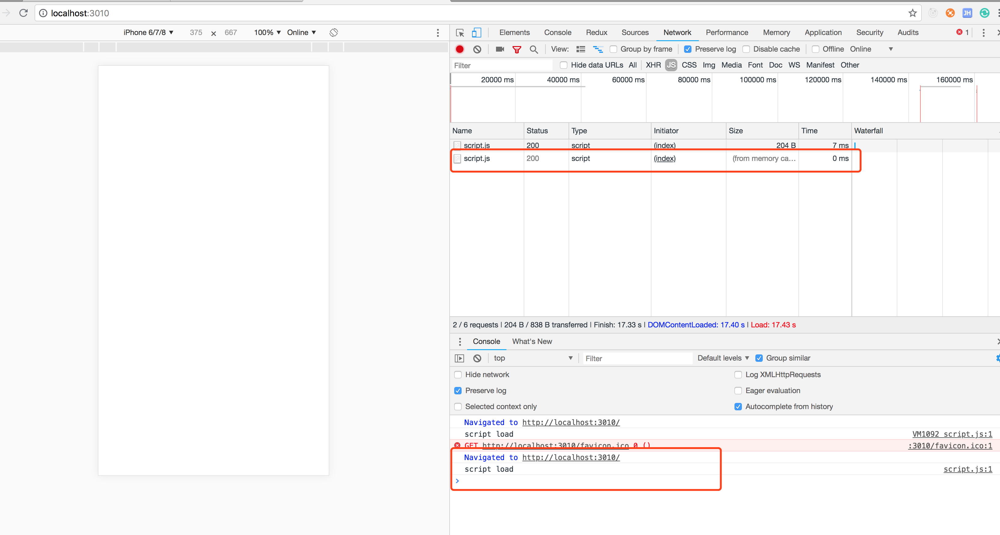
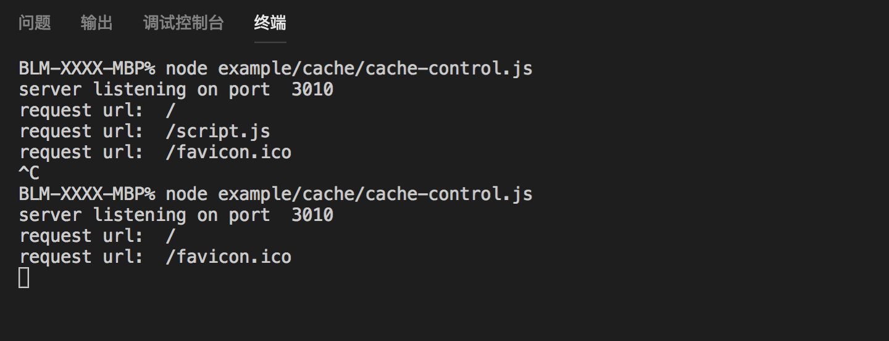
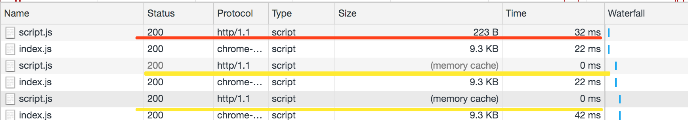
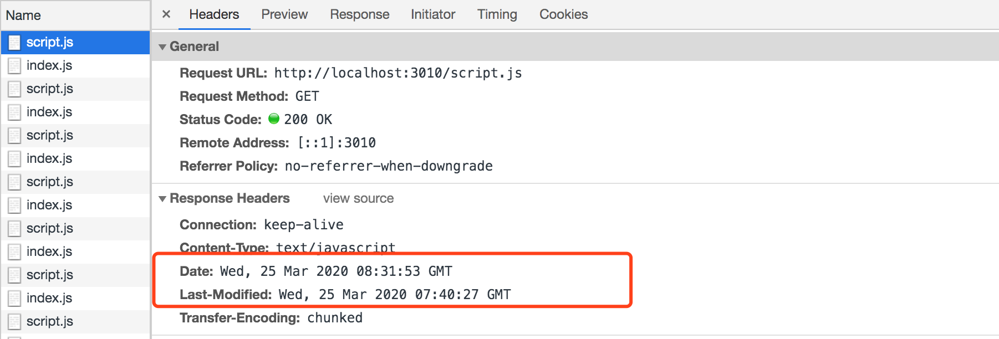
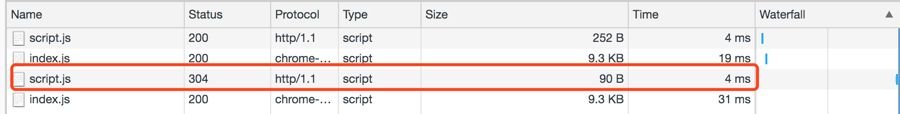
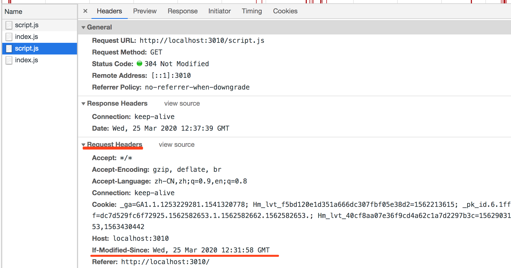
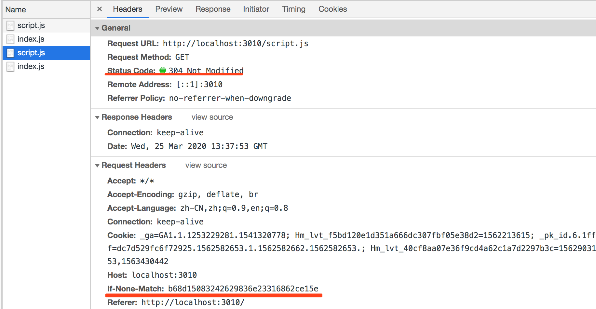

# 理论加实践一次搞懂浏览器缓存策略

## 几个阶段

### 1. 强缓存策略

浏览器端发起请求之后不会直接向服务器请求数据，直接先到达强缓存阶段，如果强缓存命中直接返回，如果没有命中进入下一阶段**协商缓存策略**。

### 2. 协商缓存策略

协商缓存是当强缓存没有命中的情况或者按下 F5 键刷新页面会触发，它每次都会携带标识与服务器进行校验，符合则返回 304 标识，表示资源没有更新，如果协商缓存也失效了，进入下一个阶段获取最新数据，并返回且状态码为 200。

### 3. 存储策略

当强缓存->协商缓存都未命中，请求会直接到达服务器，获取最新资源设置缓存策略，进行返回。

## 强缓存

强缓存的实现分为 Expires、Cache-Control 两个。

### Expires

Expires 属于 HTTP 1.0 时期的产物，在响应中进行设置，示例如下：

```js
response.writeHead(200, {
    'Content-Type': 'text/javascript',
    'Expires': new Date('2020-03-25 11:19:00'),
});
```

设置成功运行 node expires.js 在 Response Headers 里可以看到如下信息：

```
Expires: Wed Mar 25 2020 11:19:00 GMT+0800 (GMT+08:00)
```

刷新两次页面，可以看到第二次 size 一栏返回了 **memory cache** 此时 Expires 缓存命中。



Expires 是参考的本地时间，如果修改本地时间，可能就会造成缓存失效。

### Cache-Control

Cache-Control 属于 HTTP 1.1 时代的产物，可以再请求头或者响应头中设置，它的取值包含如下选项：

1. 可缓存性
    * public：http 经过的任何地方都可以进行缓存（代理服务器也可缓存）
    * private：只有发起请求的这个浏览器才可以进行缓存，如果设置了代理缓存，那么代理缓存是不会生效的
    * no-cache：任何一个节点都不可以缓存（**绕过强缓存，但是还会经过协商缓存**）

2. 到期
    * max-age=<seconds>：设置缓存到多少秒过期
    * s-maxage=<seconds>：会代替 max-age，只有在代理服务器（nginx 代理服务器）才会生效
    * max-stale=<seconds>：是发起请求方主动带起的一个头，是代表即便缓存过期，但是在 max-stale 这个时间内还可以使用过期的缓存，而不需要向服务器请求新的内容

3. 重新验证
    * must-revalidate：如果 max-age 设置的内容过期，必须要向服务器请求重新获取数据验证内容是否过期
    * proxy-revalidate：主要用在缓存服务器，指定缓存服务器在过期后重新从原服务器获取，不能从本地获取

4. 其它
    * no-store：本地和代理服务器都不可以存储这个缓存，永远都要从服务器拿 body 新的内容使用（**强缓存、协商缓存都不会经过**）
    * no-transform：主要用于 proxy 服务器，告诉代理服务器不要随意改动返回的内容

#### Cache-Control 示例

**先思考两个问题?**
> 1. 在页面中引入静态资源文件，为什么静态资源文件改变后，再次发起请求还是之前的内容，没有变化呢？
> 2. 在使用webpack等一些打包工具时，为什么要加上一串hash码？

* cache-control.html

```html
<html>
    <head>
        <meta charset="utf-8" />
        <title>cache-control</title>
    </head>
    <body>
        <script src="/script.js"></script>
    </body>
</html>
```

* cache-control.js

浏览器输入 http://localhost:3010/ 加载 cache-control.html 文件，该文件会请求 http://localhost:3010/script.js 如果 url 等于 /script.js 设置 cache-control 的 max-age 进行浏览器缓存。

```js
const http = require('http');
const fs = require('fs');
const port = 3010;

http.createServer((request, response) => {
    console.log('request url: ', request.url);

    if (request.url === '/') {
        const html = fs.readFileSync('./example/cache/cache-control.html', 'utf-8');
    
        response.writeHead(200, {
            'Content-Type': 'text/html',
        });

        response.end(html);
    } else if (request.url === '/script.js') {
        response.writeHead(200, {
            'Content-Type': 'text/javascript',
            'Cache-Control': 'max-age=200'
        });

        response.end("console.log('script load')");
    }

}).listen(port);

console.log('server listening on port ', port);
```

* 第一次运行

浏览器运行结果,没有什么问题，正常响应



控制台运行结果


* 修改 cache-control.js 返回值

```js
...
response.writeHead(200, {
    'Content-Type': 'text/javascript',
    'Cache-Control': 'max-age=200'
});

response.end("console.log('script load ！！！')");
...
```

* 中断上次程序，第二次运行

浏览器运行结果

第二次运行，从 memory cahce 读取，浏览器控制台并没有打印修改过的内容



控制台运营结果

只请求了 ``` / ``` 并没有请求 ``` /script.js  ```



> 源码参考：
> github.com/Q-Angelo/http-protocol/blob/master/example/cache/cache-control.js

以上结果浏览器并没有返回给我们服务端修改的结果，这是为什么呢？

**先回答第一个问题**

> 在页面中引入静态资源文件，为什么静态资源文件改变后，再次发起请求还是之前的内容，没有变化呢？

是因为我们请求的 url ```/script.js``` 没有变，那么浏览器就不会经过服务端的验证，会直接从客户端缓存去读，就会导致一个问题，我们的js静态资源更新之后，不会立即更新到我们的客户端，这也是前端开发中常见的一个问题，我们是希望浏览器去缓存我们的静态资源文件（js、css、img等）我们也不希望服务端内容更新了之后客户端还是请求的缓存的资源， 

**回答第二个问题**

> 在使用webpack等一些打包工具时，为什么要加上一串hash码？

解决办法也就是我们在做 js 构建流程时，把打包完成的 js 文件名上根据它内容 hash 值加上一串 hash 码，这样你的 js 文件或者 css 文件等内容不变，这样生成的 hash 码就不会变，反映到页面上就是你的 url 没有变，如果你的文件内容有变化那么嵌入到页面的文件 url 就会发生变化，这样就可以达到一个更新缓存的目的，这也是目前前端来说比较常见的一个静态资源方案。

### Expires 与 Cache-Control 对比

HTTP 协议对比：Expires 属于 HTTP 1.0 时代的产物，Cache-Control 属于 HTTP 1.1 时代的产物
优先级对比：如果同时使用 Cache-Control 的 max-age 与 Expires，则 max-age 优先级会更高，会忽略掉 Expires
缓存单位：Expires 与 Cache-Control 两者的缓存单位都是以时间为维度，如果我要根据文件的内容变化来判断缓存是否失效怎么办呢？就需要用到下面的协商缓存了。

## 协商缓存

如果强缓存未命中或用户按下 F5 强制刷新后进入协商缓存，服务器则根据浏览器请求时的标识进行判断，如果协商缓存生效返回 304 否则返回 200。协商缓存的实现也是基于两点 Last-Modified、ETag 这个需要在 HTTP Headers 中设置。

### Last-Modified/If-Modified-Since

Last-Modified 是在服务端设置进行响应，If-Modified-Since 是在浏览器端根据服务端上次在 Response Headers 中设置的 Last-Modified 取其值，如果存在请求时设置其 Request Headers 值 If-Modified-Since 传到服务器，服务器也是拿到这个值进行比对，下面为核心实现。

```js
if (request.url === '/script.js') {
    const filePath = path.join(__dirname, request.url); // 拼接当前脚本文件地址
    const stat = fs.statSync(filePath); // 获取当前脚本状态
    const mtime = stat.mtime.toGMTString() // 文件的最后修改时间
    const requestMtime = request.headers['if-modified-since']; // 来自浏览器传递的值

    console.log(stat);
    console.log(mtime, requestMtime);

    // 走协商缓存
    if (mtime === requestMtime) {
        response.statusCode = 304;
        response.end();
        return;
    }

    // 协商缓存失效，重新读取数据设置 Last-Modified 响应头
    console.log('协商缓存 Last-Modified 失效');
    response.writeHead(200, {
        'Content-Type': 'text/javascript',
        'Last-Modified': mtime,
    });

    const readStream = fs.createReadStream(filePath);
    readStream.pipe(response);
}
```

执行 node last-modified.js 启动程序，浏览器执行 http://localhost:3010/ 打开页面，我多次调用发现第一次是从服务器拿的数据且状态为 200，之后每次都是 memory cache 为什么不是 304 呢？



> 源码地址
> github.com/Q-Angelo/http-protocol/tree/master/example/cache/last-modified

显然是**强缓存**生效了，你可能会想我没有设置强缓存哦😯

这是因为浏览器默认启用了一个**启发式缓存**，这在设置了 Last-Modified 响应头且没有设置 Cache-Control: max-age/s-maxage 或 Expires 时会触发，它的一个**缓存时间是用 Date - Last-Modified 的值的 10% 作为缓存时间**。



现在我们要达到 304 的效果，不走强缓存直接走协商缓存，修改我们的响应，设置 Cache-Control=max-age=0 修改如下：

```js
response.writeHead(200, {
    'Content-Type': 'text/javascript',
    'Last-Modified': mtime,
    'Cache-Control': 'max-age=0', // 修改地方
});
```

再次运行我们的程序，控制台执行 node last-modified-max-age.js 再次重新打开页面查看效果，第二次直接走的协商缓存且 Request Headers 携带了 If-Modified-Since: Wed, 25 Mar 2020 12:31:58 GMT




> 源码地址
> https://github.com/Q-Angelo/http-protocol/tree/master/example/cache/last-modified-max-age

### ETag 和 If-None-Match

Last-Modified 是以文件的修改时间来判断，Etag 是根据文件的内容是否修改来判断，如果 Etag 有修改重新获取新的资源返回，如果未修改返回 304 通知客户端使用本地缓存。

Etag 的判断主要也是在服务端通过一种 Hash 算法实现，核心实现如下：

```js
if (request.url === '/script.js') {
    const filePath = path.join(__dirname, request.url); // 拼接当前脚本文件地址
    const buffer = fs.readFileSync(filePath); // 获取当前脚本状态
    const fileMd5 = md5(buffer); // 文件的 md5 值
    const noneMatch = request.headers['if-none-match']; // 来自浏览器端传递的值

    if (noneMatch === fileMd5) {
        response.statusCode = 304;
        response.end();
        return;
    }

    console.log('Etag 缓存失效');
    response.writeHead(200, {
        'Content-Type': 'text/javascript',
        'Cache-Control': 'max-age=0',
        'ETag': fileMd5,
    });

    const readStream = fs.createReadStream(filePath);
    readStream.pipe(response);
}
```

> 源码地址
> github.com/Q-Angelo/http-protocol/tree/master/example/cache/etag

node etag.js 运行我们程序，打开我们的页面多次访问，第二次会看到浏览器会携带一个 If-None-Match 的 Header 头传递到服务端进行校验，当前协商缓存命中了所以响应状态为 304



### Last-Modified 与 Etag 对比

* 精确度：Last-Modified 以时间（秒）为单位，如果出现 1 秒内文件多次修改，在 Last-Modified 缓存策略下也不会失效，Etag 是对内容进行 Hash 比较，只要内容变动 Etag 就会发生变化，精确度更高。
* 分布式部署问题：分布式部署必然涉及到负载均衡，造成的一种现象是 Last-Modified 的时间可能还不太一致，而 Etag 只要保证每台机器的 Hash 算法是一致的就可保证一致性。
* 性能消耗：Etag 需要读取文件做 Hash 计算，相比 Last-Modified 性能上是有损耗的。
* 优先级：如果 Last-Modified/Etag 同时设置，Etag 的优先级会更高些。
* 相同点：校验通过返回 304 通知客户端使用本地缓存，校验不通过重新获取最新资源，设置 Last-Modified/Etag 响应头，返回状态码 200 。

## 疑问？

> 1. POST 可以缓存吗？

GET 是一个幂等操作，通常用于缓存，POST 是一个非幂等的操作，每次创建新的资源，也不会自动处理 POST 请求进行缓存，参考 [rfc2616-sec9.html#sec9.1](https://www.w3.org/Protocols/rfc2616/rfc2616-sec9.html#sec9.1)

## Reference

* [http://verymuch.site/2018/10/09/web-browser-cache-strategy/](http://verymuch.site/2018/10/09/web-browser-cache-strategy/)