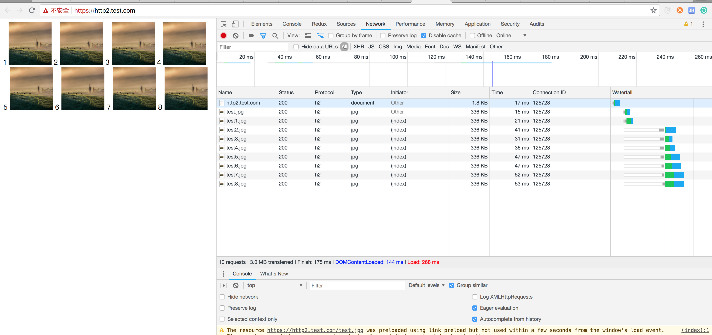

# HTTP 长链接 — HTTP1.1 与 HTTP2 下的对比

HTTP 的请求是在 TCP 链接之上进行发送，TCP 链接分为长链接、短链接的概念。

HTTP 发送请求的时候会先创建一个 TCP 链接，在 TCP 连接上把 HTTP 请求的内容发送，并接收返回，这个时候一次请求就结束了，浏览器会和服务端商量，要不要把这次 TCP 链接给关闭，如果不关闭，这个 TCP 链接就会一直开着，会有消耗，但是接下去如果还有请求，就可以直接在这个 TCP 链接上进行发送，那么就不需要经过三次握手这样的一个链接消耗，而如果直接关闭，那么在下次 HTTP 请求的时候就需要在创建一个 TCP 链接。

长链接是可以设置 timeout 的，可以设置多长时间在这个 TCP 链接上没有新的请求就会关闭。

## HTTP/1.1

HTTP/1.1 的链接在 TCP 上去发送请求是有先后顺序的，例如你有 10 个请求是不可以并发的在一个 TCP 链接上去发送，浏览器是可以允许并发的创建一个 TCP 链接，Chrome 允许的是 6 个，一次性的并发，如果你有 10 个只能等前面 6 个其中一个完成，新的请求在进去。

### http/1.1 长链接示例

**connection.html**

```html
<html>
    <head>
        <meta charset="utf-8" />
        <title>Connection</title>
    </head>
    <body>
        
        
        
        
        
        
        
        
    </body>
</html>
```

**connection.js**

```js
const http = require('http');
const fs = require('fs');
const port = 3010;

http.createServer((request, response) => {
    console.log('request url: ', request.url);

    const html = fs.readFileSync('./connection.html', 'utf-8');
    const img = fs.readFileSync('./test_img.jpg');

    if (request.url === '/') {
        response.writeHead(200, {
            'Content-Type': 'text/html',
        });

        response.end(html);
    } else {
        response.writeHead(200, {
            'Content-Type': 'image/jpg'
        });

        response.end(img);
    }
}).listen(port);

console.log('server listening on port ', port);
```

**HTTP/1.1 协议下运行结果**

可以看到第一次图片加载时复用了第一次 localhost 的 TCP 链接，最后两张图片一直在等待前面的 TCP 链接完成，有一定的响应等待。


## HTTP/2 信道复用

在 HTTP/2 中有一个新的概念**信道复用**，在 TCP 连接上可以并发的去发送 HTTP 请求，链接一个网站只需要一个TCP链接 (同域的情况下)

由于 HTTP/2 目前只能运行在 HTTPS 协议下需要先借助 Nginx 部署一个 HTTPS 协议的服务。

### Nginx 部署 HTTPS 服务

**生成 public key 和 private key**

/usr/local/etc/nginx/certs 目录下执行以下命令

```
openssl req -x509 -newkey rsa:2048 -nodes -sha256 -keyout localhost-privkey.pem -out localhost-cert.pem
```

```bash
Generating a 2048 bit RSA private key
...............................................................................+++
..............+++
writing new private key to 'localhost-privkey.pem'
-----
You are about to be asked to enter information that will be incorporated
into your certificate request.
What you are about to enter is what is called a Distinguished Name or a DN.
There are quite a few fields but you can leave some blank
For some fields there will be a default value,
If you enter '.', the field will be left blank.
-----
Country Name (2 letter code) [AU]:
State or Province Name (full name) [Some-State]:
Locality Name (eg, city) []:
Organization Name (eg, company) [Internet Widgits Pty Ltd]:
Organizational Unit Name (eg, section) []:
Common Name (e.g. server FQDN or YOUR name) []:
Email Address []:
```

**配置 http2.test.conf 文件**

文件目录 /usr/local/etc/nginx/servers/ 下创建 http2.test.conf 文件

```conf
# HTTP 自动跳转 HTTPS
server {
    listen          80 default_server;
    listen          [::]:80 default_server; # [::] 你的ip
    server_name     http2.test.com;
    return 302 https://$server_name$request_uri;
}

server {
    listen          443 ssl http2;
    server_name     http2.test.com;
    http2_push_preload on; 

    ssl_certificate_key /usr/local/etc/nginx/certs/localhost-privkey.pem;
    ssl_certificate /usr/local/etc/nginx/certs/localhost-cert.pem;

    location / {
        proxy_pass http://127.0.0.1:30100;
        proxy_set_header Host $host;
    }
}
```

**修改本地 hosts 域名 IP 映射**

vim /private/etc/hosts 增加如下配置，不了解为什么要加这样一个配置的，可以看看 DNS 域名解析过程

```
127.0.0.1 http2.test.com
```

**运行测试**

代码还是基于上面 HTTP/1.1 协议的示例，记得修改示例的端口为我们在 Nginx 里配置的 30100

启动 Nodejs Demo 示例，浏览器窗口执行 https://http2.test.com 可以看到返回的 Connection ID 得到了复用，且图片资源同时进行了响应



测试 HTTP/2 在不同情况的行为 [http2-lab](https://http2.akamai.com/demo/http2-lab.html)