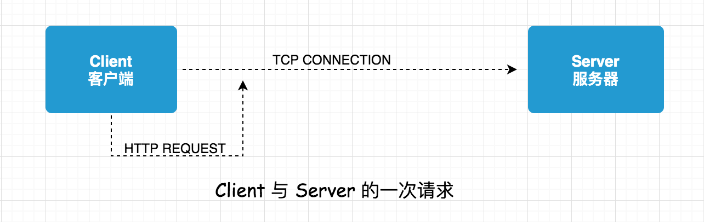
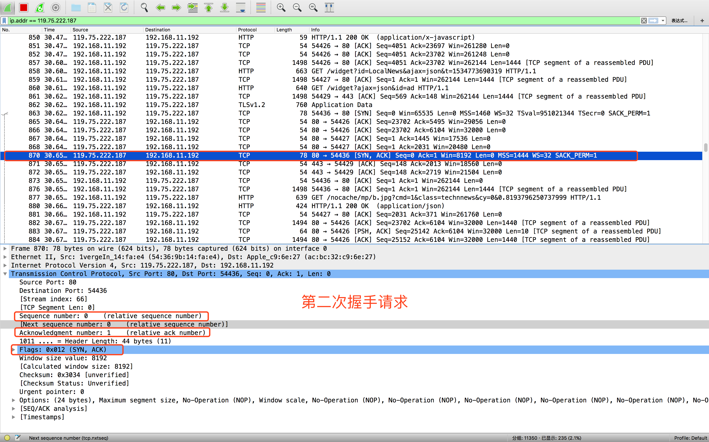

# HTTP 协议中的 TCP 三次握手和四次分手

先清楚一个概念 HTTP 请求 与 TCP 链接之间的关系。

客户端向服务端请求和返回的过程中，需要创建一个 TCP connection，因为 **HTTP 是不存在链接这样一个概念的，它只有请求和响应这样一个概念，请求和响应都是一个数据包，中间要通过一个传输通道，这个传输通道就是在 TCP 里面创建一个从客户端发起和服务端接收的一个链接**，TCP 链接在创建的时候是有一个三次握手(三次网络传输)这样一个消耗在的。

## TCP 三次握手过程

<strong>第一次握手:</strong>  建立连接，客户端A发送SYN=1、随机产生Seq=client_isn的数据包到服务器B，等待服务器确认。

<strong>第二次握手:</strong> 服务器B收到请求后确认联机(可以接受数据)，发起第二次握手请求，ACK=(A的Seq+1)、SYN=1，随机产生Seq=client_isn的数据包到A。

<strong>第三次握手:</strong> A收到后检查ACK是否正确，若正确，A会在发送确认包ACK=服务器B的Seq+1、ACK=1，服务器B收到后确认Seq值与ACK值，若正确，则建立连接。

<strong>TCP标示</strong>:
1. SYN(synchronous建立联机)
2. ACK(acknowledgement 确认)
3. Sequence number(顺序号码)

### TCP 三次握手数据包详细内容分析

这里采用的是 [wireshark 官网地址 https://www.wireshark.org/](https://www.wireshark.org/)，是一个很好的网络数据包抓取和分析软件。

示例采用的网址 [http://news.baidu.com/](http://news.baidu.com/)，windows 下打开 cmd、Mac 下打开终端 ping 下得到 ip 可以利用 wireshark 工具进行一次 ip 地址过滤，只分析指定的数据。

**1. 第一次握手**

客户端发送一个TCP，标志位为SYN，Seq(序列号)=0，代表客户端请求建立链接，如下图所示

**2. 第二次握手**

服务器发回数据包，标志位为 [SYN, ACK]，ACK 设置为客户端第一次握手请求的 Seq+1，即 ACK=0+1=1，在随机产生一个 Seq 的数据包到客户端。

**3. 第三次握手**

客户端在次发送确认数据包，标识位为 ACK，把服务器发来的 Seq+1，即 ACK=0+1，发送给服务器，服务器成功收到 ACK 报文段之后，连接就建立成功了。

### 为什么要经过三次握手呢

TCP 三次握手是为了防止服务端开启一些无用的链接，网络传输是有延时的，中间可能隔着非常远的距离，通过光纤或者中间代理服务器等，客户端发送一个请求，服务端收到之后如果直接创建一个链接，返回内容给到客户端，因为网络传输原因，这个数据包丢失了，客户端就一直接收不到服务器返回的这个数据，超过了客户端设置的时间就关闭了，那么这时候服务端是不知道的，它的端口就会开着等待客户端发送实际的请求数据，服务这个开销也就浪费掉了。

## TCP 四次分手

1. 第一次分手

客户端设置 Seq（Sequence Number）、ACK 向服务端发送一个 FIN=1 报文段，此时客户端进入 FIN_WAIT 状态，表示客户端没有数据发送给服务端了。

2. 第二次分手

服务端收到客户端的 FIN=1 报文段之后，回复 ACK 给到客户端，意为同意你的关闭请求。

3. 第三次分手

服务端向客户端发送 FIN 报文段，请求关闭连接，进入 LAST_ACK  状态。

4. 第四次分手

客户端收到服务端的 FIN 报文段之后，同时向服务端做最后 ACK 确认，且不会立即关闭链接，而是进入 TIME_WAIT 状态，等待 2MSL 时间片段，若 MSL 时间片段内收到服务端的回复，进行重传，若没有收到服务端的回复，则表示服务端已关闭，客户端也进行关闭。

**为什么要等待 2MSL 时间片段**

参考知乎 [www.zhihu.com/question/36930631](https://www.zhihu.com/question/36930631)